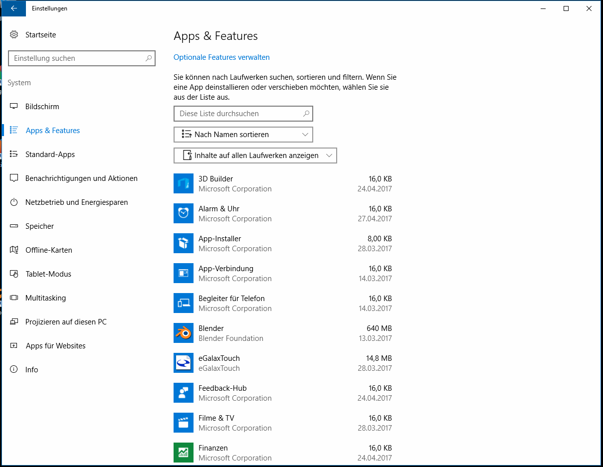

# Einrichten eines Gigabyte Brix Mini-PCs für den Chrome Kiosk-Mode

In diesem Tutorial richten wir einen [Gigabyte Brix Mini-PC](https://www.amazon.de/gp/product/B01LX9KYWS/ref=oh_aui_detailpage_o02_s00?ie=UTF8&psc=1) für den den Einsatz von [Google-Chrome](https://www.google.de/chrome/browser) im Kiosk-Modus auf einem Touchscreen ein.

Beim Kiosk-Modus ist nur Google-Chrome mit einer offline-Webseite geöffnet. Der Nutzer kann Google-Chrome und die Webseite dabei nicht verlassen.
Dies ist ideal für den Einsatz bei Austellungen, Messen oder für Werbe- und Informationsdisplays.

## 1. Vorbereitungen

### PC Anschließen

Jetzt den PC einmal anschalten und warten bis Windows 10 hochgefahren ist.

### Google-Chrome installieren

Lade nun [Google-Chrome](https://www.google.de/chrome/browser) herunter und installiere es auf dem Mini-PC.

## 2. Einstellungen öffnen

## 3. Systemeinstellungen anpassen

### Bildschirm

Hier die Größe auf **100%** und Ausrichtung auf **Querformat** setzen.

### Apps & Features

Hier alle unnötigen Apps, bis auf Google-Chrome, deinstallieren. Einige Apps können nicht deinstalliert aber deaktivert werden.

### Benachrichtigungen und Aktionen

Hier Benachrichtungen und Windows Tipps **aus** schalten.

### Netzbetrieb und Energiesparen

Hier Netzbetrieb ausschalten und Energiesparmodus auf **Nie** schalten.

Anschließend **Zusätzliche Energieeinstellungen** öffnen.

Hier den **Ausbalanciert** Modus wählen und anschließend **Auswählen, was beim Drücken von Netzschalter geschehen soll** öffnen.

Hier **Herunterfahren** auswählen und prüfen, dass **Schnellstart aktivieren** ausgeschalten ist. Ist Schnellstart aktivieren eingeschalten, kann der PC nicht korrekt über den Netzschalter ein- und ausgeschalten werden.

### Offline-Karten

Hier **Alle Karten löschen** und die Getaktete Verbindung als auch die Kartenaktualisierungen **aus** schalten.

### Tablet-Modus

Hier den **Passenden Modus für meine Hardware verwenden** auswählen. App-Symbole auf der Taskleiste einblenden auf **ein** und die Taskleiste automatisch ausblenden auf **aus** stellen.

### Projizieren auf diesen PC

Hier das Projizieren auf **Immer deaktiviert** schalten.
Bei Fragen, ob auf diesen PC projiziert werden darf **Bei jeder Verbindungsanforderung** auswählen.

Bei PC kann nur für die Projektion ermittelt werden, wenn er angeschlossen ist **ein** anwählen.

### Apps für Websites

Hier alles Apps **aus** schalten.

## 4. Personalisierung

### Sperrbildschirm

Hier den Anzeige des Hintergrundbilds auf dem Sperrbildschirm **aus** schalten.

Anschließen **Cortana-Einstellungen für den Sperrbildschirm** öffnen und dort alles ausschalten ...

... sowie den **Gesamten Geräteverlauf löschen**.

Anschließend die **Einstellungen für Bildschirmschoner** öffnen ...

... und den Bildschirmschoner deaktivieren.

### Start

Hier alles **aus** schalten.

## 5. Konten

### Anmeldeoptionen

Falls noch nicht geschehen, hier ein Kennwort vergeben.

Anschließend die das Anzeigen der Kontodetails auf dem Anmeldebildschirm **aus** schalten.

## 6. Erleichterte Bedienung

### Bildschirmlupe

Hier den Mauszeiger folgen **ein** und alles andere **aus** schalten.

### Hoher Kontrast

Hier **Kein** Design auswählen.

### Tastatur

Hier alles **aus** schalten.

### Maus

Hier Maus mithilfe der Zehnertastatur bewegen **aus** schalten.

### Weitere Optionen

Hier Animationen in Windows, den Windows-Hintergrund sowie Visuelle Benachrichtigungen für Sound **aus** schalten.

Optischen Feedback beim Berühren des Bildschirms und Dunkles, größeren optisches Feedback **ein** schalten.

## 7. Datenschutz

### Allgemein

Hier alles **aus** schalten.

### Position

Hier alles **aus** schalten.

### Kamera

Hier alles **aus** schalten.

### Mikrofon

Hier alles **aus** schalten.

### Spracherkennung

Hier alles das **Kennenlernen beenden**.

### Kontoinformationen

Hier alles **aus** schalten.

### Kontakte

Hier alles **aus** schalten.

### Kalender

Hier alles **aus** schalten.

### Anrufliste

Hier alles **aus** schalten.

### E-Mail

Hier alles **aus** schalten.

### Messaging

Hier alles **aus** schalten.

### Weitere Geräte

Hier alles **aus** schalten.

### Feedback und Diagnose

Hier Mein Feedback soll von Windows angefordert werden auf **Nie** und Sendet Ihre Gerätedaten auf **Einfach** setzen.

### Hintergrund-Apps

Hier alles **aus** schalten.

## 8. Update und Sicherheit

### Windows Defender

Hier den Echtzeitschutz **ein** und alles andere **aus** schalten.

### Aktivierung

Hier, falls noch nicht geschehen, die Windows-Version **aktivieren**.

## 9. Windows Updater deaktivieren

Zuerst über Start > Windows-System, **Ausführen** öffnen.

Hier **services.mcs** eingeben.

Jetzt den Eintrag **Windows Update** öffnen ...

... und bei Startyp **Deaktiviert** auswählen.

## 10. Automatische Anmeldung einrichten

Zuerst über Start > Windows-System, **Ausführen** öffnen.

Hier **netplwiz** eingeben ...

... und dann Benutzer müssen Benutzernamen und Kennwort eingeben **deaktivieren**.

Nun noch den Nutzernamen des anzumeldenden Nutzers und das Passwort eingeben.

## 11. Kiosk-Modus einrichten

Zuerst über Start > Windows-System, **Ausführen** öffnen.

Hier **regedit** eingeben ...

... und dann den Eintrag `HKEY_LOCAL_MACHINE\SOFTWARE\Microsoft\Windows NT\CurrentVersion\Winlogon/Shell` öffnen.

Hier nun folgenden Wert eingeben: `C:\Program Files (x86)\Google\Chrome\Application\chrome.exe --incognito --disable-pinch --overscoll-history-navigation=0 --kiosk file:///D:/build/paintings.html`

Tausche dabei `file:///D:/build/paintings.html` gegen die HTML-Datei aus, welche du im Kiosk-Modus öffnen möchtest. In diesem Fall befindet sich die Datei auf einem USB-Stick, welcher über den USB 3.0 (eSata) Anschluss am vorderen Teil des Mini-PCs angeschlossen ist. Dies ist zu empfehlen, da dadurch jederzeit die Webseite aktualisiert werden kann, indem einfach nur die Daten auf dem USB-Stick aktualisiert werden.

## 12. PC neu starten

Nach dem Neustart sollte der Mini-PC automatisch die Webseite im Kiosk-Modus aufrufen. Entferne die USB-Tastatur und schon kann mittels Touchscreen auf der Webseite navigiert werden.

## 13. Kiosk-Modus verlassen

Schließe zunächst wieder die USB-Tastatur an den Mini-PC an.

Drücke **STRG+ALT+ENTF** und öffne anschließend den **Task-Manager**.

Führe nun über Datei > Neuen task ausführen ...

... die **explorer.exe** aus, um in die Windows Dateiverwaltung zu kommen.

Oder, um den Kiosk-Modus wieder zu deaktivieren:

Führe die **regedit** aus und ...

Trage unter `HKEY_LOCAL_MACHINE\SOFTWARE\Microsoft\Windows NT\CurrentVersion\Winlogon/Shell` wieder **explorer.exe** ein.

Nach einem Neustart des PCs ist dann der Kiosk-Modus wieder deaktiviert.
